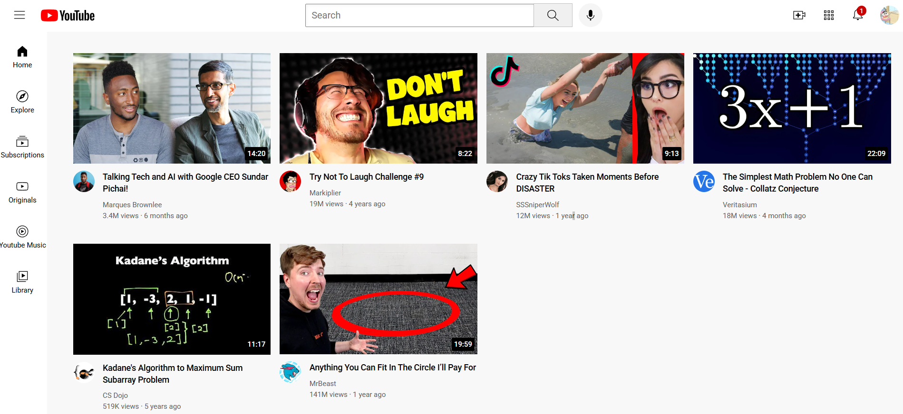

# YouTube Clone Frontend

A pixel-perfect YouTube homepage clone built with pure HTML and CSS.
No JavaScript, no frameworks — just clean markup and styling.

## 🚀 Live Demo
https://deepinder-gill.github.io/youtube-clone-frontend/yt.html

## 📸 Preview


## 🛠️ Built With
- HTML5
- CSS3 (Flexbox, Grid, Position)

## ✨ Features
- Fixed responsive header with search bar
- Collapsible sidebar with navigation icons
- Video grid with thumbnails, timestamps and channel info
- Pixel accurate recreation of YouTube's UI
- Clean folder structure with separate CSS files

## 📁 Project Structure
```
youtube-clone-frontend/
├── icons/
├── thumbnails/
├── channel-pictures/
├── styles/
│   ├── general.css
│   ├── header.css
│   ├── sidebar.css
│   └── video.css
└── yt.html
```

## 🎯 Purpose
Part of my frontend development journey — HTML/CSS foundation
before moving into JavaScript and React.

## 👤 Author
**Deepinder Singh Gill**
- GitHub: [@deepinder-gill](https://github.com/deepinder-gill)
- LinkedIn: [deepinder-gill](https://www.linkedin.com/in/deepinder-gill-2944903b3/)

